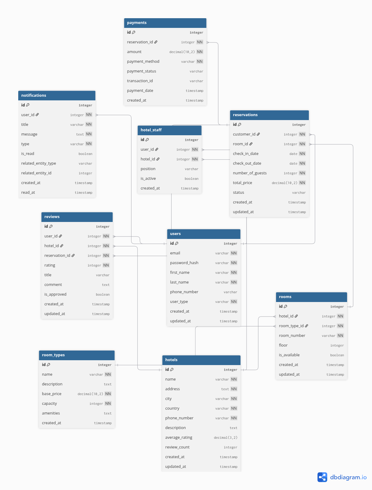

# Hotel Booking API

A comprehensive RESTful API built with NestJS for managing hotel bookings, reservations, payments, and user authentication. This scalable backend system provides secure endpoints for customers, hotel staff, and administrators to manage the complete hotel booking lifecycle.

## Table of Contents

- [Features](#features)
- [Tech Stack](#tech-stack)
- [Database Schema](#database-schema)
- [API Documentation](#api-documentation)
- [Installation](#installation)
- [Configuration](#configuration)
- [Running the Application](#running-the-application)
- [Project Structure](#project-structure)
- [Authentication & Authorization](#authentication--authorization)
- [API Endpoints](#api-endpoints)
- [Docker Support](#docker-support)
- [Contributing](#contributing)

## Features

- **User Management**: Multi-role authentication (Customer, Staff, Admin)
- **Hotel Management**: Complete CRUD operations for hotels and room management
- **Reservation System**: Booking management with availability checking
- **Payment Processing**: Stripe integration for secure payment handling
- **Real-time Notifications**: Email and SMS notifications for booking updates
- **Review System**: Customer feedback and rating system for hotels and services
- **Notification Management**: Comprehensive notification system with multiple delivery channels
- **Role-based Access Control**: Secure endpoints with JWT authentication
- **Comprehensive API Documentation**: Swagger/OpenAPI documentation
- **Caching**: Redis integration for improved performance
- **Database**: PostgreSQL with TypeORM for robust data management

## Tech Stack

- **Framework**: NestJS (Node.js)
- **Language**: TypeScript
- **Database**: PostgreSQL
- **ORM**: TypeORM
- **Authentication**: JWT
- **Payment**: Stripe
- **Caching**: Redis
- **Documentation**: Swagger/OpenAPI
- **Containerization**: Docker
- **Validation**: Class-validator, Class-transformer

## Database Schema

The application uses a well-structured relational database with the following main entities:



### Core Tables:

- **Users**: Multi-role user management (Customer, Staff, Admin)
- **Hotels**: Hotel information and details
- **Hotel Staff**: Junction table linking staff to hotels
- **Room Types**: Room categories and pricing
- **Rooms**: Individual room management
- **Reservations**: Booking and reservation tracking
- **Payments**: Payment processing and transaction history
- **Notifications**: User notification system with multiple delivery channels
- **Reviews**: Hotel and service reviews with rating system

## API Documentation

The API is fully documented using Swagger/OpenAPI. Once the application is running, you can access the interactive documentation at:

```
http://localhost:3000/api/docs
```

## Installation

1. **Clone the repository**

   ```bash
   git clone <repository-url>
   cd hotel-booking-api
   ```

2. **Install dependencies**

   ```bash
   npm install
   ```

3. **Set up environment variables**
   ```bash
   cp .env.example .env
   # Edit .env with your configuration
   ```

## Configuration

Create a `.env` file in the root directory with the following variables:

```env
# Database
DATABASE_HOST=localhost
DATABASE_PORT=5432
DATABASE_USERNAME=your_username
DATABASE_PASSWORD=your_password
DATABASE_NAME=hotel_booking

# JWT
JWT_SECRET=your_jwt_secret
JWT_EXPIRATION=24h

# Redis
REDIS_HOST=localhost
REDIS_PORT=6379

# Stripe
STRIPE_SECRET_KEY=your_stripe_secret_key
STRIPE_WEBHOOK_SECRET=your_stripe_webhook_secret

# Email (optional)
SMTP_HOST=your_smtp_host
SMTP_PORT=587
SMTP_USER=your_email
SMTP_PASS=your_password
```

## Running the Application

### Development Mode

```bash
# Start the application in watch mode
npm run start:dev
```

### Production Mode

```bash
# Build the application
npm run build

# Start the production server
npm run start:prod
```

### Using Docker

```bash
# Build and start all services
docker-compose up -d
```

## Project Structure

```
src/
├── auth/                 # Authentication module
│   ├── decorators/      # Custom decorators
│   ├── guards/          # Authentication guards
│   ├── dto/             # Data transfer objects
│   └── interfaces/      # Type definitions
├── config/              # Configuration files
├── constants/           # Application constants
├── hotels/              # Hotel management
├── rooms/               # Room management
├── room-types/          # Room type management
├── reservations/        # Reservation system
├── payments/            # Payment processing
├── users/               # User management
├── hotel-staff/         # Staff management
├── notifications/       # Notification system (In Development)
├── reviews/             # Review and rating system (In Development)
└── stripe/              # Stripe integration
```

## Authentication & Authorization

The API implements a robust authentication system with:

- **JWT-based Authentication**: Secure token-based authentication
- **Role-based Access Control**: Different access levels for Customer, Staff, and Admin
- **Guards**: `AuthorizeGuard` for token validation and `RolesGuard` for role checking
- **Decorators**: `@Roles()`, `@ActiveUser()`, and `@AllowAnonymous()` for endpoint protection

### User Roles:

- **Customer**: Can make reservations, view their bookings, make payments
- **Staff**: Can manage hotel operations, view reservations, process check-ins/outs
- **Admin**: Full system access, user management, hotel management

## API Endpoints

### Authentication

- `POST /auth/login` - User login
- `POST /auth/register-customer` - Customer registration
- `POST /auth/register-staff` - Staff registration

### Hotels

- `GET /hotels` - List all hotels
- `POST /hotels` - Create hotel (Admin only)
- `GET /hotels/:id` - Get hotel details
- `PATCH /hotels/:id` - Update hotel (Admin only)
- `DELETE /hotels/:id` - Delete hotel (Admin only)

### Rooms

- `GET /rooms` - List rooms
- `POST /rooms` - Create room (Staff/Admin)
- `GET /rooms/:id` - Get room details
- `PATCH /rooms/:id` - Update room (Staff/Admin)
- `DELETE /rooms/:id` - Delete room (Staff/Admin)

### Reservations

- `GET /reservations` - List reservations
- `POST /reservations` - Create reservation
- `GET /reservations/:id` - Get reservation details
- `PATCH /reservations/:id` - Update reservation
- `DELETE /reservations/:id` - Cancel reservation

### Payments

- `GET /payments` - List payments
- `POST /payments` - Create payment
- `GET /payments/:id` - Get payment details
- `POST /payments/:id/confirm` - Confirm payment
- `POST /payments/:id/refund` - Process refund

### Notifications (In Development)

- `GET /notifications` - List user notifications
- `POST /notifications` - Create notification
- `GET /notifications/:id` - Get notification details
- `PATCH /notifications/:id/read` - Mark notification as read
- `DELETE /notifications/:id` - Delete notification

### Reviews (In Development)

- `GET /reviews` - List reviews
- `POST /reviews` - Create review
- `GET /reviews/:id` - Get review details
- `PATCH /reviews/:id` - Update review
- `DELETE /reviews/:id` - Delete review
- `GET /hotels/:id/reviews` - Get hotel reviews

## Docker Support

The application includes Docker configuration for easy deployment:

```bash
# Build the Docker image
docker build -t hotel-booking-api .

# Run with Docker Compose
NODE_ENV= development docker-compose up -d
```

## Contributing

1. Fork the repository
2. Create a feature branch (`git checkout -b feature/amazing-feature`)
3. Commit your changes (`git commit -m 'Add some amazing feature'`)
4. Push to the branch (`git push origin feature/amazing-feature`)
5. Open a Pull Request

## License

This project is licensed under the MIT License - see the [LICENSE](LICENSE) file for details.
